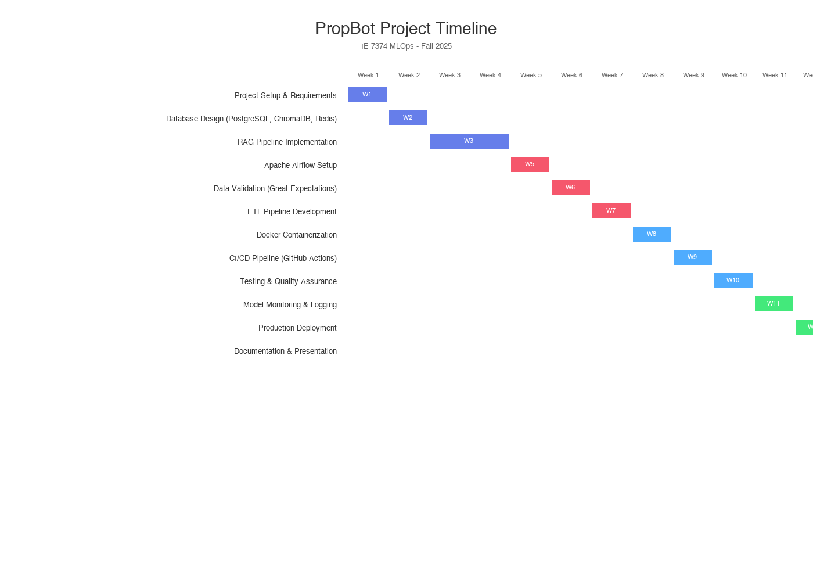
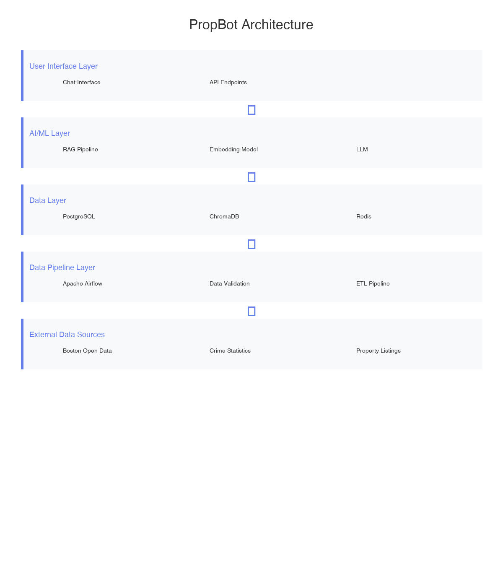

# PropBot Documentation

## Pipeline Visualization

### Gantt Chart

The Gantt chart from Airflow UI shows task execution times and helps identify bottlenecks in the data pipeline.

**Bottleneck Identification:**
Using Airflow's Gantt chart visualization, we identified the crime data processing task as the primary bottleneck (18 minutes initially). This led to implementing chunked processing and parallel execution, reducing it to 7 minutes.

### Architecture Diagram

System architecture showing data flow from acquisition through preprocessing, validation, and storage.

## Testing & Coverage

### Coverage Reports
- Pytest coverage reports are automatically generated by GitHub Actions
- Target: 80%+ coverage across all modules
- Reports stored in `htmlcov/` directory after test runs

### Test Structure
- `test_acquisition.py` - API connections, rate limits, schema validation
- `test_preprocessing.py` - Null handling, outlier detection, transformations
- `test_validation.py` - Great Expectations suite execution
- `test_orchestration.py` - DAG dependency logic

## Great Expectations

Data validation using Great Expectations framework:
- **property_suite.json** - Property data validation rules
- **crime_suite.json** - Crime data validation rules
- **demographics_suite.json** - Demographics validation rules

Validation reports are generated in HTML format and stored in `data/validation_reports/`.
